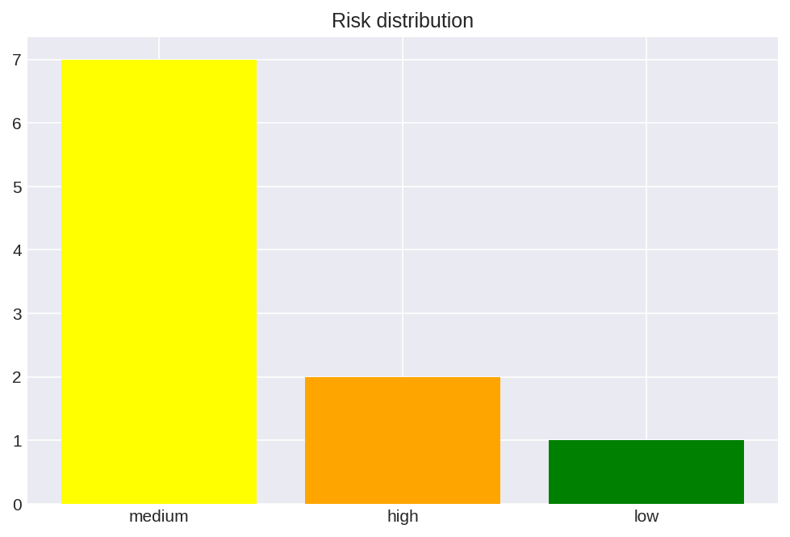
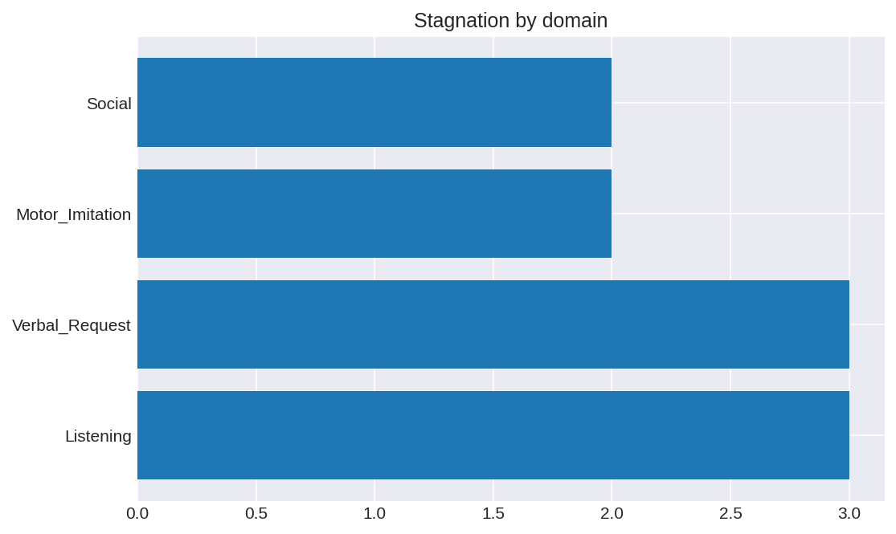
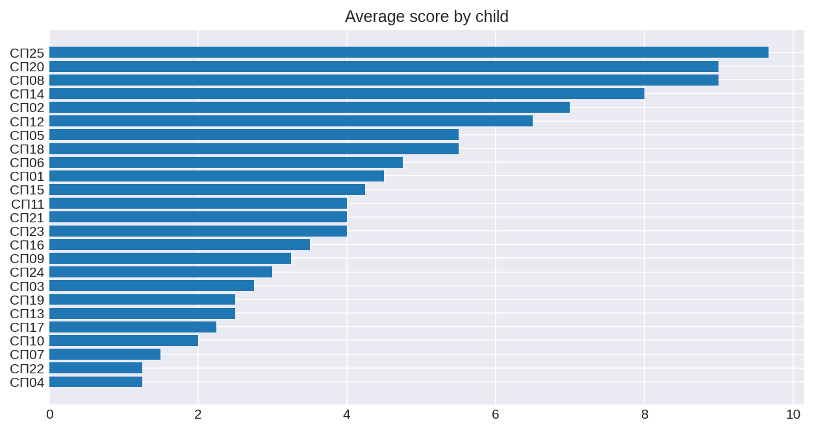
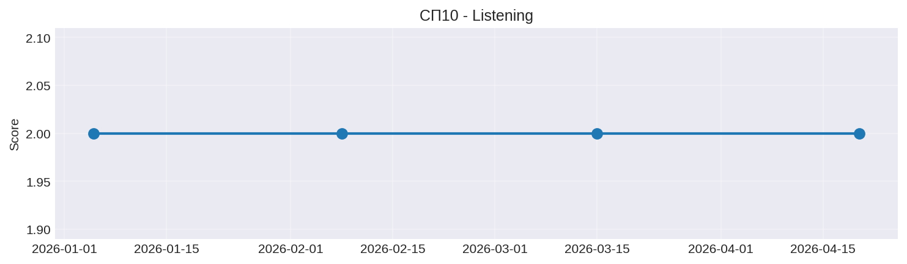
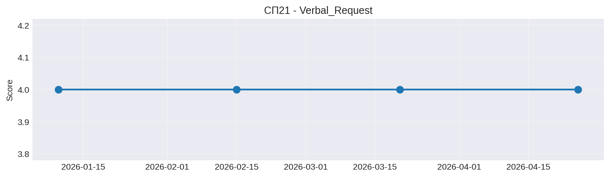

# Children Stagnation Detector

AI-детектор застоя прогресса у детей с ОВЗ.

**Репозиторий:** https://github.com/SKZHPRVT/children_stagnation

## Быстрый старт

```bash
git clone https://github.com/SKZHPRVT/children_stagnation.git
cd children_stagnation
python3 -m venv venv
source venv/bin/activate
pip install -r requirements.txt
python3 main.py
pytest tests/ -v
```

## Скриншоты







## Мотивация

Проект помогает детям с ОВЗ. Готов уделять 15-20 ч/неделю, 3-6 месяцев.
